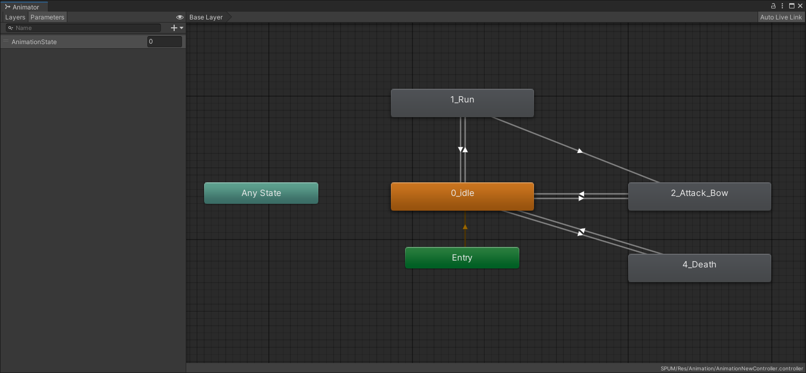
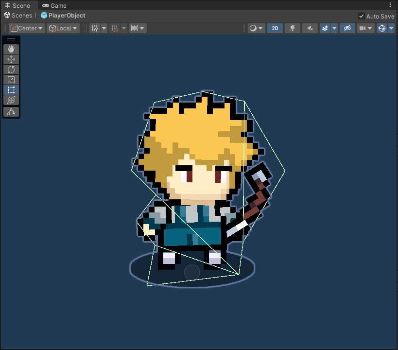
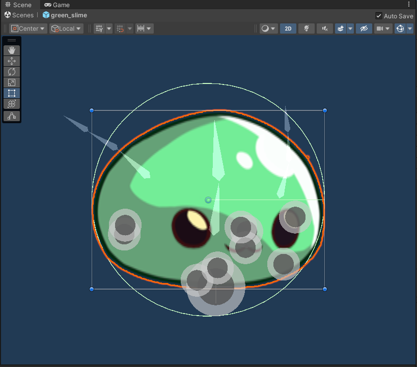
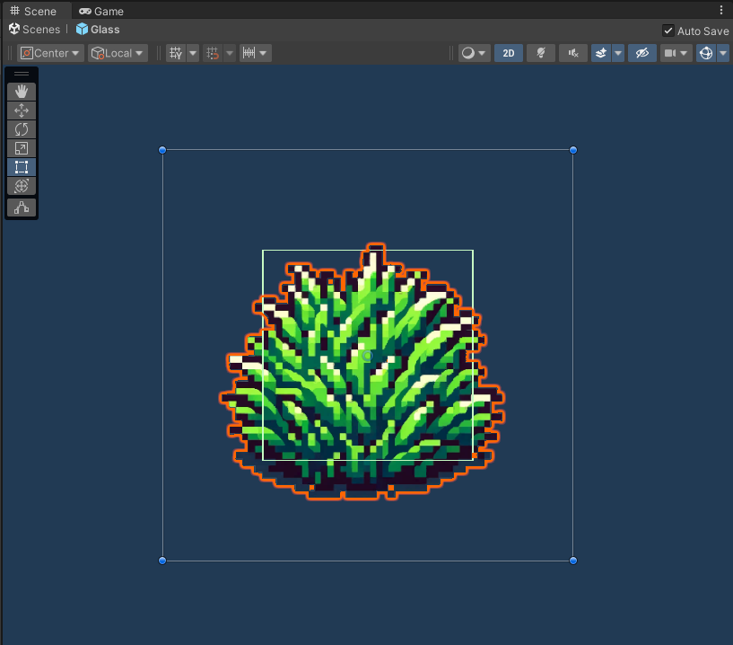
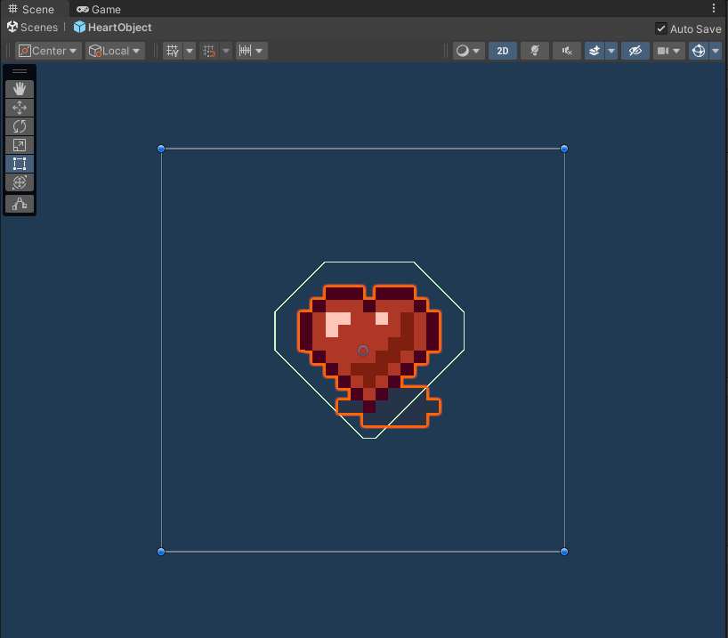

# Project_HAL

<br>

## 프로젝트 소개
- **개발 기간**   
  2024.03.09 ~ 2024.06.24
- **개발 환경**   
  Unity 2022.3.21f
- **프로젝트 목적**   
  Unity Game Engine을 이용하여 간단한 탑뷰 2D 게임을 제작함으로써 게임 개발에 필요한 지식을 이해하는 것 목적으로 한다.
- **주요 기술 및 도구**   
  - Framework: Unity (C#)
  - Design Pattern : Entity-Component, SingleTone
- **멤버 구성**:
  개발 4명
- **기여 내용**:
  - 역할: PlayerEntity, EnemyEntity, VirtualCameraManager, UI, PickableObjects 설계 및 작성
  - 기여율: 25%

<br>

---

<br>

## 프로젝트 구조
```plaintext
├── Resources/
│   ├── Prefabs/
│   │   ├── UI/
│   │   │   ├── HPBar/
│   │   │   │   ├── BossHPBar.prefab                # 보스 몬스터의 HP Bar 프리팹
│   │   │   │   ├── EnemyHPBarUI.prefab             # 일반 몬스터의 HP Bar 프리팹
│   │   │   │   ├── PlayerHPBarUI.prefab            # 플레이어의 HP Bar 프리팹
│   │   │   ├── Inventory/
│   │   │   │   ├── InventoryUI.prefab              # 인벤토리 UI 프리팹
│   │   │   │   ├── SlotUI.prefab                   # 인벤토리 슬롯 UI 프리팹
│   │   ├── CoinObject.prefab                       # 맵에 드랍할 수 있는 Coin 프리팹
│   │   ├── Dummy.prefab                            # 더미(일반 몬스터) 프리팹
│   │   ├── HeartObject.prefab                      # 맵에 드랍할 수 있는 Heart 프리팹
│   │   ├── GameManager.prefab                      # GameManager 프리팹
│   │   ├── PlayerObject.prefab                     # 플레이어 객체 프리팹
│   ├── ScriptableObjects/
│   │   ├── Coin.asset                              # Item을 상속받아 구현한 Coin Item
│   │   ├── DummyHPManager.asset                    # StatManager를 상속받아 Dummy의 Stat을 구현한 StatManager
│   │   ├── Heart.asset                             # Item을 상속받아 구현한 Heart Item
│   │   ├── Item.cs                                 # Item을 정의한 ScriptableObject
│   │   ├── StatManager.asset                       # StatManager를 상속받아 플레이어의 Stat을 구현한 StatManager
│   │   ├── StatManager.cs                          # Entity Stat을 정의한 ScriptableObject
├── Scripts/
│   ├── Entity/
│   │   ├── Entity.cs                               # Entity의 최상위 클래스
│   │   ├── EnemyEntity.cs                          # Entity를 상속받아 적 몬스터의 초기화, 피격 및 공격 등에 관련한 코드
│   │   ├── PlayerEntity.cs                         # Entity를 상속받아 플레이어의 초기화, 이동, 애니메이션 재생 등에 관련한 코드
│   ├── Manager/
│   │   ├── GameManager.cs                          # 게임 매니저 관련 코드 (싱글톤 패턴)
│   │   ├── VirtualCameraManager.cs                 # 가상 카메라와 관련 변수와 함수들에 관련한 코드
│   ├── UI/
│   │   ├── HPBarUI.cs                              # 플레이어의 화면에 표시되는 HP UI
│   │   ├── InventorySlotUI.cs                      # 인벤토리 슬롯 하나에 해당하는 UI
│   │   ├── InventoryUI.cs                          # InventorySlotUI 여러개를 모은 하나의 Inventory UI. Inventory 상 아이템의 습득, 폐기, 이동에 관련한 코드
│   ├── PickableObjects.cs                          # 필드에 드랍할 수 있는 Item에 관련한 코드
├── SPUM/
│   ├── Res/
│   │   ├── Animation/
│   │   │   ├── Clip/
│   │   │   │   ├── *.anim                           # 캐릭터의 애니메이션 파일들
│   │   │   ├── AnimatinoNewController.controller    # 캐릭터의 애니메이션을 상태에 따라 제어

```

<br>

---

<br>

## 주요 기능 및 구조도
### 1. 캐릭터 이동 및 캔슬  
  
- **설명**:   
  마우스 우클릭으로 클릭을 한 곳까지 캐릭터를 움직일 수 있고, 캐릭터가 움직이는 도중 키보드의 's'키를 누르면 캐릭터가 그 자리에 멈춘다.
  마우스 좌클릭으로 공격을 할 수 있고, 캐릭터가 공격을 하는 도중 일정 시간이 지나면 마우스 우클릭 명령으로 공격 애니메이션을 캔슬할 수 있다.
- **주요 기술**:   
     
  AnimationController와 Coroutine을 이용해 애니메이션의 재생 제어
- **구현 방법**:   
  - 캐릭터의 이동 및 멈춤   
    ``` C#
    void FixedUpdate()
    {
        if (is_alive && !(is_animation_started ^ is_animation_cancelable))
        {
            // Stop Player
            if (Input.GetKey(KeyCode.S))
            {
                CharacterStop();
            }
            // Walk
            else
            {
                MoveCharacter_Mouse();
                vectorreset();
            }
        }
        UpdateMovement();
        UpdateAnimationState();
    ...
    }
    ```
    캐릭터의 이동은 FixedUpdate() 함수에서 매 프레임마다 이동에 대한 연산을 통해 이루어진다.
    1. MoveCharacter_Mouse() 함수에서 마우스를 클릭한 좌표 값을 찾아 target_pos 변수에 저장한다.
    2. vectorrest() 함수에서 캐릭터가 움직일 방향을 계산하고 vector 변수에 저장한다.
    3. UpdateMovement() 함수에서 캐릭터의 rigidbody 컴포넌트의 velocity 변수의 값을 vector와 미리 정해진 velocity를 곱해 결정한다.
    4. 캐릭터의 현재 상태에 맞는 애니메이션을 재생한다.
  
    ``` C#
    public void CharacterStop()
    {
        is_moveable = false;
        target_pos = transform.position;
        vector = Vector2.zero;
    }
    ```
    캐릭터의 멈춤은 FixedUpdate() 함수에서 매 프레임마다 키보드 's' 키의 입력에 대한 여부를 판단해 이루어진다.
    1. 플레이어가 's' 키를 눌렀다면 단순하게 CharacterStop() 함수를 호출해 is_moveable을 false로 만들고 캐릭터의 목표 지점이 target_pos를 현재 위치로 덮어쓴다.
    2. is_moveable이 false가 되면 MoveCharacter_Mouse() 함수에서 target_pos를 계산하지 않는다.
    3. 또한 vector가 0이므로 캐릭터의 속도가 0이 된다.
  - 캐릭터의 애니메이션 캔슬
    ``` C#
    public void PlayAnimation(string action)
    {
        if (is_animation_cancelable)
        {
            CharacterIdleSet();
            is_animation_started = true;
            is_animation_cancelable = true;
            StopCoroutine(animation_coroutine);
            animation_coroutine = null;
    
            if (animation_coroutine == null)
            {
                animation_coroutine = StartCoroutine(action, animator);
            }
    
            transform.localScale = (GetMousePos().x - GetPos().x) > 0 ? new Vector3(playerscale, playerscale, 1.0f) : new Vector3(-playerscale, playerscale, 1.0f);
        }
        else
        {
            is_animation_started = true;
    
            if (animation_coroutine == null)
            {
                animation_coroutine = StartCoroutine(action, animator);
            }
    
            transform.localScale = (GetMousePos().x - GetPos().x) > 0 ? new Vector3(playerscale, playerscale, 1.0f) : new Vector3(-playerscale, playerscale, 1.0f);
        }
    }
    ```
    캐릭터의 애니메이션 재생과 캔슬은 캐릭터의 이동보다 복잡하다.
    캐릭터의 특정 애니메이션 재생 및 캔슬은 PlayAnimation() 함수를 통해 이루어진다. 이때 애니메이션 재생과 관련된 변수로 is_animation_started, is_animation_playing, is_animation_cancelable가 있다.
    - is_animation_started는 애니메이션이 재생되기 시작하면 true로 바뀌고, 애니메이션이 끝나면 false로 바뀐다.
    - is_animation_playing은 애니메이션이 재생 중일 때만 true가 된다.
    - is_animation_cancelable은 애니메이션이 재생된 이후, 강제로 애니메이션을 종료할 수 있으면 true가 된다.
    캐릭터의 애니메이션 재생 및 캔슬은 위의 세 변수를 통해 이루어진다.
    ``` C#
    public void CharacterIdleSet()
    {
        animator.SetInteger(animationState, (int)AnimationStateEnum.idle);
        is_animation_started = false;
        is_animation_playing = false;
        is_animation_cancelable = false;
    }
    ```
    우선 애니메이션을 재생하기 전에 관련 변수들을 모두 초기화한다.
    1. 캐릭터의 애니메이션을 Idle로 바꾼다.
    2. 캐릭터의 애니메이션 재생과 관련된 세 변수를 모두 false로 초기화한다.
    3. 캐릭터의 애니메이션 재생을 담당하는 코루틴을 중지한다.
    4. 새로운 애니메이션을 재생할 코루틴을 생성하고 애니메이션을 재생한다.

    ``` C#
    public IEnumerator Attack(Animator animator)
    {
        if (!is_animation_playing)
        {
            CharacterStop();
    
            // 이전에 재생되던 애니메이션이 존재 (캔슬한 경우)
            if (is_animation_cancelable)
            {
                while (!animator.GetCurrentAnimatorStateInfo(0).IsName("0_idle"))
                {
                    animator.SetInteger(animationState, (int)AnimationStateEnum.idle);
                    yield return null;
                }
                is_animation_cancelable = false;
            }
    
            while (!animator.GetCurrentAnimatorStateInfo(0).IsName("2_Attack_Bow"))
            {
                animator.SetInteger(animationState, (int)AnimationStateEnum.attack);
                yield return null;
            }
    
            while (animator.GetCurrentAnimatorStateInfo(0).normalizedTime < 1.0f)
            {
                is_animation_playing = true;
                if (animator.GetCurrentAnimatorStateInfo(0).normalizedTime > 0.5f)
                {
                    is_animation_cancelable = true;
                    is_moveable = true;
                }
                yield return null;
            }
    
            if (is_animation_playing)
            {
                CharacterIdleSet();
            }
        }
        is_animation_started = false;
        animation_coroutine = null;
    }
    ```
    캐릭터가 공격할 때 공격 애니메이션을 재생하는 과정은 위의 코드를 통해 확인할 수 있다.
    1. 캐릭터의 애니메이션이 재생중이지 않으면, 캐릭터를 그 자리에 멈춘다.
    2. 캐릭터의 현재 상태를 "2_Attack_Bow"로 바꾸면 공격 애니메이션이 재생되기 시작하므로 is_animation_playing을 true로 바꾼다.
    3. 공격 애니메이션의 재생 시간이 1.0f 이상이 될 때까지 기다린다.
    4. 공격 애니메이션의 재생 시간이 0.5f 이상이 되면 is_animation_cancelable을 true로 바꾸어 그 뒤의 애니메이션을 강제로 종료할 수 있음을 알린다.
    5. 공격 애니메이션의 재생이 모두 끝나면 캐릭터를 Idle 상태로 바꾼다.
    6. is_animation_started 변수를 false로 만들고, 코루틴을 null로 만들어 애니메이션 재생을 종료한다.

### 2. 상호작용   
  
- **설명**:   
  Entity는 맵에 배치되어 있는 다른 Entity들과 데미지를 주거나 받고, 객체를 파괴할 수 있는 등 여러 상호작용을 할 수 있다.
- **주요 기술**:   
  <p align="center">
    
    
    
    
  </p>
  
  Entity에 부착되어 있는 Collider2D 컴포넌트를 활용한 상호작용
- **구현 방법**:   
  ``` C#
  private void OnTriggerEnter2D(Collider2D collision)
  {
      if (is_alive && collision.gameObject.CompareTag(pickable_objects))
      {
          PickableObjects hitObject = collision.gameObject.GetComponent<PickableObjects>();
  
          if (hitObject != null)
          {
              bool should_disappear = false;
  
              //print("Hit: " + hitObject.GetName());
              switch (hitObject.Item.ItemType)
              {
                  case Item.ItemTypeEnum.GRASS:
                  case Item.ItemTypeEnum.STONE:
                  case Item.ItemTypeEnum.COIN:
                      should_disappear = inventory_ui.AddItem(hitObject);
                      break;
                  case Item.ItemTypeEnum.HEALTH:
                      should_disappear = stat_manager.AdjustHP(hitObject.Quantity);
                      break;
              }
  
              if (should_disappear)
              {
                  Destroy(collision.gameObject, .0f);
              }
          }
      }
  }
  ```
  PlayerEntity는 OnTriggerEnter2D() 함수를 통해 다른 Entity의 Collider2D 컴포넌트와의 충돌을 감지할 수 있다. 특히 Tag를 비교해 충돌한 Entity의 성질을 감지할 수 있는데, 위의 코드에서는 PickableObject Entity만 감지하도록 작성했다.
  ``` C#
  void OnCollisionEnter2D(UnityEngine.Collision2D collision)
  {
      // 플레이어가 Enemy의 Collision에 들어감
      if (collision.gameObject.CompareTag("Player"))
      {
          PlayerEntity player = collision.gameObject.GetComponent<PlayerEntity>();
  
          if (player.player_damage_coroutine == null)
          {
              // interval의 딜레이마다 damage_scale의 피해를 입힌다
              player.player_damage_coroutine = StartCoroutine(player.DamageEntity(damage_scale, 1.0f, this.gameObject));
          }
      }
  }
  ```
  플레이어가 몬스터한테 피격 당하는 경우는 EnemyEntity의 OnCollisionEnter2D() 함수를 활용해 구현했다. PlayerEntity가 EnemyEntity의 Collision에 충돌할 경우 1.0f의 간격으로 캐릭터에게 데미지를 가하는 코루틴을 재생하도록 했다.

### 3. 아이템 습득, 폐기 및 이동   
  
- **설명**:   
  플레이어는 맵에 드랍된 아이템을 주워 인벤토리에 저장할 수 있다. 또한 인벤토리에 저장되어 있는 아이템을 클릭-드래그를 통해 순서를 바꿀 수도 있고, 맵에 드랍할 수도 있다.
- **주요 기술**:
  배열과 prefab을 통한 인벤토리와 기능 구현
- **구현 방법**:   
  ``` C#
  public void CreateSlots()
  {
      if (slotPrefab != null)
      {
          for (int i = 0; i < numSlots; i++)
          {
              GameObject newSlot = Instantiate(slotPrefab);
              newSlot.name = "ItemSlot_" + i;
  
              // gameObject.transform.GetChild(0)은 InventoryBackground
              newSlot.transform.SetParent(inventory_background.transform);
  
              slots[i] = newSlot;
  
              // newSlot.transform.GetChild(1)은 ItemImage
              itemImages[i] = newSlot.transform.GetChild(1).GetComponent<Image>();
          }
  
          duplicatedSlot = Instantiate(slotPrefab);
          duplicatedSlot.name = "ItemDuplicateSlot";
          duplicatedSlot.transform.SetParent(inventory_background.transform);
          duplicatedSlot_RectTransform = duplicatedSlot.GetComponent<RectTransform>();
          duplicatedSlot_Image = duplicatedSlot.transform.GetChild(1).GetComponent<Image>();
          duplicatedSlot_QtyText = duplicatedSlot.transform.GetComponentsInChildren<TMP_Text>()[0];
          // Disable Slot Background Image
          duplicatedSlot.transform.GetChild(0).gameObject.GetComponent<Image>().enabled = false;
          // Disable Slot Tray Image
          duplicatedSlot.transform.GetChild(0).GetChild(0).gameObject.GetComponent<Image>().enabled = false;
      }
  }
  ```
  먼저 numSlots만큼 InventorySlot을 만들고 slots[] 배열에 순서대로 저장한다. 그리고 또 하나의 InventorySlot을 만들고 이를 duplicatedSlot 변수에 저장한다.
  ``` C#
  public bool AddItem(PickableObjects itemToAdd)
  {
      for (int i = 0; i < items.Length; i++)
      {
          if (items[i] != null && items[i].ItemType == itemToAdd.Item.ItemType && itemToAdd.Item.Stackable == true)
          {
              InventorySlotUI slotScript = slots[i].GetComponent<InventorySlotUI>();
              TMP_Text qtyText = slotScript.transform.GetComponentsInChildren<TMP_Text>()[0];
  
              if (qtyText != null)
              {
                  //qtyText.enabled = true;
                  int qty = int.Parse(qtyText.text);
                  qty += itemToAdd.Quantity;
                  qtyText.text = qty.ToString();
              }
  
              return true;
          }
      }
      for (int i = 0; i < items.Length; i++)
      {
          if (items[i] == null)
          {
              items[i] = Instantiate(itemToAdd.Item);
              itemImages[i].sprite = itemToAdd.Item.Sprite;
              itemImages[i].enabled = true;
              InventorySlotUI slotScript = slots[i].GetComponent<InventorySlotUI>();
              TMP_Text qtyText = slotScript.transform.GetComponentsInChildren<TMP_Text>()[0];
  
              if (qtyText != null)
              {
                  qtyText.enabled = true;
                  int qty = itemToAdd.Quantity;
                  qtyText.text = qty.ToString();
              }
  
              return true;
          }
      }
      return false;
  }
  ```
  인벤토리에 아이템을 추가하는 것은 간단하다.
  1. 인벤토리를 순회하며 추가하려는 아이템이 이미 존재하는지 확인한다.
  2. 만약 존재한다면 해당 위치에 추가하려는 아이템의 수량을 더한다.
  3. 만약 존재하지 않는다면 인벤토리를 다시 순회하며 비어 있는 마지막 위치에 아이템을 추가한다.
  4. 만약 인벤토리가 하나도 비어 있지 않다면 false를 반환한다.
  ``` C#
  public bool MoveItem(int targetSlotNum)
  {
      GameObject src = duplicatedSlot;
      TMP_Text src_qty_text = duplicatedSlot_QtyText;
      Image src_image = duplicatedSlot_Image;
  
      GameObject dst = slots[targetSlotNum];
      TMP_Text dst_qty_text = dst.transform.GetComponentsInChildren<TMP_Text>()[0];
      Image dst_image = itemImages[targetSlotNum];
  
      int quantity = int.Parse(duplicatedSlot_QtyText.text);
      // Destination Slot is empty
      if (items[targetSlotNum] != null)
      {
          //Debug.Log("item.objectname = " + items[targetSlotNum].ObjectName + ", item.sprite = " + items[targetSlotNum].Sprite + "items.stackable" + items[targetSlotNum].Stackable + "items.itemType" + items[targetSlotNum].ItemType);
      }
          
      if (AddItemAt(new PickableObjects(items[clicked_slot], quantity), targetSlotNum))
      {
          //Debug.Log("Slot is empty");
          if (int.Parse(slots[clicked_slot].transform.GetComponentsInChildren<TMP_Text>()[0].text) - quantity != 0)
          {
              return DeleteItem(clicked_slot, quantity);
          }
          else
          {
              ClearSlot(clicked_slot);
              ClearSlot(numSlots);
              return true;
          }
      }
      // Destination Slot is not empty
      else
      {
          //SwapSlot();
          // Swap
          if (int.Parse(src_qty_text.text) == quantity)
          {
              GameObject srcSlots = slots[clicked_slot];
              string srcQty = srcSlots.transform.GetComponentsInChildren<TMP_Text>()[0].text;
              PickableObjects srcTmp = new PickableObjects(items[clicked_slot], int.Parse(srcQty));
              ClearSlot(clicked_slot);
  
              GameObject dstSlots = slots[targetSlotNum];
              string dstQty = dstSlots.transform.GetComponentsInChildren<TMP_Text>()[0].text;
              PickableObjects dstTmp = new PickableObjects(items[targetSlotNum], int.Parse(dstQty));
              ClearSlot(targetSlotNum);
  
              AddItemAt(srcTmp, targetSlotNum);
              AddItemAt(dstTmp, clicked_slot);
  
              ClearSlot(numSlots);
  
              return true;
          }
          else
          {
              /*
              Item tmpItems = new Item(items[targetSlotNum]);
              Image tmpItemImages = itemImages[targetSlotNum];
              GameObject tmpSlots = slots[targetSlotNum];
  
              items[targetSlotNum] = items[targetSlotNum];
              itemImages[targetSlotNum] = itemImages[targetSlotNum];
              slots[targetSlotNum] = slots[targetSlotNum];
  
              items[targetSlotNum] = tmpItems;
              itemImages[targetSlotNum] = tmpItemImages;
              slots[targetSlotNum] = tmpSlots;
  
  
              */
              ClearSlot(numSlots);
              
              return true;
          }
  
      }
      return false;
  }
  ```
  인벤토리 내의 선택한 아이템의 위치를 바꾸는 것은 생각보다 복잡했다.
  1. 먼저 클릭해 선택한 아이템을 duplicatedSlot에 복사한다.
  2. 목적지 슬롯이 비어있다면 단순히 아이템을 추가하고, 선택했던 슬롯의 아이템은 삭제한다.
  3. 만약 목적지 슬롯이 비어있지 않다면 두 슬롯의 아이템을 서로 바꾸고, duplicatedSlot을 삭제한다.
 
  ``` C#
  private bool DropItem()
  {
      // Drop Clicked Slot's Item
      string prefab_path = null;
      GameObject prefab_to_spawn;
  
      prefab_path = "Prefabs/";
  
      switch (itemToDrop.ItemType)
      {
          case Item.ItemTypeEnum.COIN:
              prefab_path += "CoinObject";
              break;
          case Item.ItemTypeEnum.GRASS:
              prefab_path += "Glass_PickableObject";
              break;
          case Item.ItemTypeEnum.STONE:
              prefab_path += "Stone_PickableObject";
              break;
      };
  
      if (prefab_path != null)
      {
          prefab_to_spawn = Resources.Load<GameObject>(prefab_path);
  
          PlayerEntity player = GameObject.FindWithTag("Player").GetComponent<PlayerEntity>();
          Vector2 playerPos = player.GetPos();
          //Vector2 mousePos = player.GetMousePos().normalized;
          Vector3 spawnPos = new Vector3(playerPos.x, playerPos.y - 0.5f, 0.0f);
          GameObject spawnObject = Instantiate(prefab_to_spawn, spawnPos, Quaternion.identity);
          PickableObjects spawnItem = spawnObject.GetComponent<PickableObjects>();
          spawnItem.Quantity = int.Parse(duplicatedSlot_QtyText.text);
          //Debug.Log("spawnItem.Quantity = " + spawnItem.Quantity);
  
          // Clear Slot
          ClearSlot(clicked_slot);
          ClearSlot(numSlots);
  
          return true;
      }
      return false;
  }
  ```
  아이템을 월드에 드랍하는 것은 duplicatedSlot을 활용해 어렵지 않게 구현했다.
  1. 선택한 아이템의 prefab을 불러온다.
  2. prefab의 수량을 조절하고, 월드에 스폰한다.
  3. duplicatedSlot을 삭제한다.

<br>

---

<br>

## 데모
- **YouTube 링크**:   
  [](https://www.youtube.com/watch?v=RwQ4D90kwPk)
